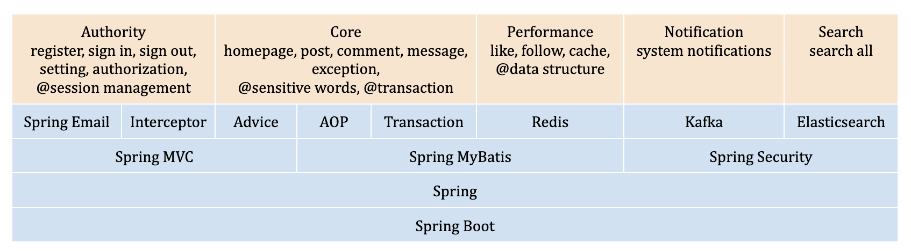

# NowCoder
NowCoder is an Online Discussion Forum, which is a full stack  web application, where users can  discuss and post comments.

### Features
* Register, sign in and sign out user account.
* Create, delete and search posts, follow and unfollow
* Create, delete and reply comments.
* Send private messages, and receive system notifications.
* Support fuzzy search of posts, and highlighted keywords in the result.

### Tools and Technologies
* <strong>Front-end: </strong>HTML5, CSS3, JavaScript, Bootstrap 5, AJAX
* <strong>Back-end: </strong>Java, SpringBoot, SpringMVC, Tomcat
* <strong>Database: </strong>MySQL, Redis
* <strong>MiddleWare: </strong>Kafka, Elasticsearch

